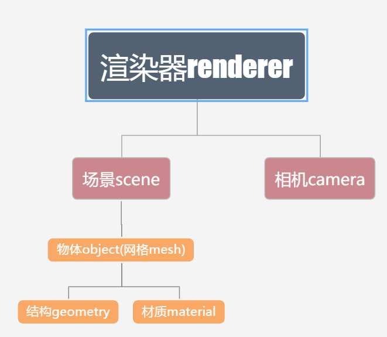
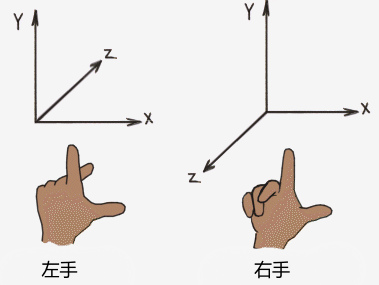

# 1-1 WebGL和three.js简介
## WebGL three.js是什么
- webgl  
 (全称Web Graphics Library)是一种JavaScript API，用于在不使用插件的情况下在任何兼容的网页浏览器中呈现交互式2D和3D图形。维基百科: https://zh.wikipedia.org/wiki/WebGL  
 说白了就是可以让你用JS在浏览器里写3D的一套方案.  
- Three.js   
  官网: https://threejs.org/   
  是一个跨浏览器的脚本，使用JavaScript函数库或API来在网页浏览器中创建和展示动画的三维计算机图形。Three.js使用WebGL。源代码托管在GitHub。维基百科: https://zh.wikipedia.org/wiki/Three.js    
 其实就是封装了webgl的一个框架或者说库.  
- 其他webgl框架/库  
  - babylon.js   
  比较偏向于游戏,自带物理引擎
  - PlayCanvas  
  比较偏向于游戏,有一套不错的可视化编辑工具(有点像unity)
  - Cesium  
  比较纯粹的地图引擎,想做非地图的项目,还是用其他库吧  

## 准备
- 基础知识  
  - 需要一些js基础  
- 材料/工具  
  - three.js  
  本课程使用的版本是three.js的0.106.2版本,为了避免不必要的麻烦,请确保你使用的three.js版本是0.106.2  
    - 下载方式1  
    npm `npm install three@0.106.2`  
    - 下载方式2  
    另存为或复制到本地 https://gitee.com/break_egg/three.js/raw/master/build/three.js  
  - 浏览器  
  推荐使用版本较新的chrome浏览器,我现在的版本是(75.0.3770.100)  
  - 编辑器  
  这个其实无所谓啦,大家习惯用啥就用啥吧.我使用的是vscode,之后会有一节课简单讲一下怎么使用vscode.

## 第一个案例  
### html部分 
```HTML
<!DOCTYPE html>
<html lang="en">
<head>
    <meta charset="UTF-8">
    <meta name="viewport" content="width=device-width, initial-scale=1.0">
    <meta http-equiv="X-UA-Compatible" content="ie=edge">
    <title>Document</title>
    <style>
        body { margin: 0; }
        canvas { display:block; } /*将canvas的display设为block,默认inline的话底下会有边框一样的空白*/
    </style>
</head>
<body>
    <script src="./three.js"></script> <!-- 引入three.js库 -->
    <script src="./firstlesson.js"></script> <!-- 引入我们自己写的js文件 -->
</body>
</html>
```

### js部分
- 创建场景,相机和渲染器 添加渲染器的dom到网页 并渲染
	```JS
	var scene = new THREE.Scene(); //创建场景
	var camera = new THREE.PerspectiveCamera(50,window.innerWidth/window.innerHeight,0.1,2000); //创建相机 (参数分别是   FOV:可视角度,  aspect ratio:宽高比,  near:近剪切面,  far:远剪切面)
	var renderer =  new THREE.WebGLRenderer(); //创建渲染器  

	renderer.setSize(window.innerWidth,window.innerHeight); //设置渲染器的宽高
	document.body.appendChild(renderer.domElement); // 将渲染器的dom添加进body中

	renderer.render(scene,camera); // 将场景和相机交给渲染器进行渲染
	```
	- 此时打开网页,我们会看到网页一片漆黑,什么都没有.打开控制会发现,body中多了一个canvas元素.而它的宽高就是我们之前使用`renderer.setSize()`设定的宽高.  
	- 这个canvas元素就是我们webgl/three进行渲染的部分.如果说浏览器,网页是web前端程序员的战场.那么canvas就是我们这些写webgl/three人的战场.没有canvas我们写的webgl/three将毫无意义.

- 添加物品 移动相机 渲染
	```JS
	var geometry = new THREE.BoxGeometry(1,1,1); // 创建一个方块结构体,长宽高都为1
	var material = new THREE.MeshBasicMaterial({color:0x123456}); // 创建一个网格基础材质,颜色使用16进制设为0x123456
	var cube = new THREE.Mesh(geometry,material); // 通过之前创建的结构体和材质,创建网格
	scene.add(cube); // 将网格添加到场景中

	camera.position.z=10; // 移动相机z轴位置

	renderer.render(scene,camera); // 再次渲染
	```
	- 之所以要移动相机,是因为默认情况下,任何物体和相机的坐标都是(0,0,0)点.那也就是说,我们的相机和物体(网格)位置重合了.我们的相机在物体的里面.而默认情况下,材质使用单面渲染.当相机在物体里面时,你可能什么都看不到.我们移动相机是为了将相机移出物体内部.  
	- 你也许观察到,代码中又执行了一次渲染`renderer.render()`.因为它不像我们网页中的dom元素.添加到网页之后,你改变dom的css或内容,他就会马上自动显示刷新出来.在three中,我们每次移动,添加物品,相机后.都需要一次渲染`renderer.render()`之后才能看到改变后的样子.  

- 自动调用渲染  
	```JS
	function animate(){ // 定义一个animate函数
		requestAnimationFrame(animate); // 将animate函数作为回调函数传给requestAnimationFrame方法

		cube.rotation.x+=0.01; // 旋转网格的x轴
		cube.rotation.y+=0.01; // 旋转网格的y轴

		renderer.render(scene, camera); // 渲染
	}

	animate(); // 执行animate函数
	```
	- 之前说到每有一点变化,想要看效果就要执行一次渲染`renderer.render()`.这样显然非常麻烦.所以定义一个animate函数,将渲染操作加入改函数,然后每隔0.0几秒就让它执行一次.
	- requestAnimationFrame它是浏览器自带的一个函数,跟three没有关系.他的用法和setTimeout非常类似,都是过几秒去执行回调函数.setTimeout可以自己设定间隔的时间,而requestAnimationFrame是1/60的时间间隔去执行.当页面被切换requestAnimationFrame会被暂停调用,以节省性能和电量的消耗.

- 窗口尺寸变化自适应
	```JS
	window.onresize=function(){ // 将函数赋予window.onresize
		camera.aspect=window.innerWidth/window.innerHeight; // 设置相机的宽高比
		camera.updateProjectionMatrix(); // 重新计算投影矩阵
		renderer.setSize(window.innerWidth,window.innerHeight); // 设置渲染器宽高
	}
	```
	- 当我们打开控制台时,窗口尺寸就会发生变化.但canvas却当假装没看见,于是就出现了白边,不居中之类的问题.定义窗口尺寸变化事件解决这一问题.  

### 完整JS代码
```JS
var scene = new THREE.Scene(); //创建场景
var camera = new THREE.PerspectiveCamera(50,window.innerWidth/window.innerHeight,0.1,2000); //创建透视相机 (参数分别是   FOV:可视角度,  aspect ratio:宽高比,  near:近剪切面,  far:远剪切面)
var renderer =  new THREE.WebGLRenderer(); //创建渲染器
renderer.setSize(window.innerWidth,window.innerHeight); //设置渲染器的宽高
document.body.appendChild(renderer.domElement); // 将渲染器的dom添加进body中
renderer.render(scene,camera); // 将场景和相机交给渲染器进行渲染

var geometry = new THREE.BoxGeometry(1,1,1); // 创建一个方块结构体,长宽高都为1
var material = new THREE.MeshBasicMaterial({color:0x123456}); // 创建一个网格基础材质,颜色使用16进制设为0x123456
var cube = new THREE.Mesh(geometry,material); // 通过之前创建的结构体和材质,创建网格
scene.add(cube); // 将网格添加到场景中
camera.position.z=10; // 移动相机z轴位置
renderer.render(scene,camera); // 再次渲染

function animate(){ // 定义一个animate函数
	requestAnimationFrame(animate); // 将animate函数作为回调函数传给requestAnimationFrame方法
	cube.rotation.x+=0.01; // 旋转网格的x轴
	cube.rotation.y+=0.01; // 旋转网格的y轴
	renderer.render(scene, camera); // 渲染
}
animate(); // 执行animate函数

window.onresize=function(){ // 将函数赋予window.onresize
	camera.aspect=window.innerWidth/window.innerHeight; // 设置相机的宽高比
	camera.updateProjectionMatrix(); // 重新计算投影矩阵
	renderer.setSize(window.innerWidth,window.innerHeight); // 设置渲染器宽高
}
```
- 其实animate函数外的两个`renderer.render()`(第6行,第13行)可以删除啦

### 透视相机
   
### 案例的结构
  
 # 坐标
## threejs坐标系
- threejs中有世界坐标系,本地坐标系,甚至还有屏幕坐标...这节课说的主要是世界坐标系,其他的以后再说.
- threejs是webgl的库,所以它坐标系其实就继承于webgl,也就是说他们俩的坐标系是一样的.
- webgl处理的是三维图形,使用了笛卡尔坐标系(三维坐标系).除了我们上学时常见的X轴,Y轴又添加了一个Z轴.
- webgl使用的是右手坐标系
    - 右手第一根手指(大拇指)向右代表X轴正方向,第二根(食指)向上代表Y轴正方向,第三根(中指)向自己的后方代表Z轴正方向
    - X轴和Y轴其实就和我们中学时学习的坐标系一样,
    - 其他引擎或者建模软件用的可能是左手坐标系(比如unity,虚幻4).还有就是用的同样是右手坐标系,但是他的垂直轴是Z轴,而Y轴成了水平的前后方向.(比如blender).所以在导入导出模型,或者抄代码的时候.坐标系的不同可能会产生和预期不符的效果.
    

### canvas尺寸
既然聊得坐标系,顺便说一下canvas的尺寸的问题
- canvas的实际尺寸是canvas的width和height决定的
    - html中
    ```HTML
    <canvas width="800" height="600">
    ```
    - js中
    ```JS
    let canvas = document.createElement("canvas");
    canvas.width=800;
    canvas.height=600;
    ```
- 当然你可以给canvas设置css控制宽高(屏幕上显示的宽高),但那样就像对一张图片设置css对图片进行拉扯或者挤压操作,不会改变图片的实际分辨率和大小.

## threejs物体坐标
- three中,物体的坐标`obj.position`也就是位置的值使用的是`THREE.Vector3`这个类型.
    - `THREE.Vector3`
        - 从单词字面意思可以看出`Vector3`其实指的就是一个三维向量,但在实际使用中,很多不能算向量的东西也是用它作为类型保存的.比如我们的位置/坐标信息`position`,上堂课中使用过的旋转角度`rotation`.
        - `Vector3`有4个属性`.x : Float`,`.y : Float`,`.z : Float`和`.isVector3 : Boolean`
            - 很明显,如果我们将`Vector3`赋给`position`那么`.x : Float`就是代表了x轴的坐标,`.y : Float`就是代表了y轴的坐标,`.z : Float`就是代表了z轴的坐标.
            - `.isVector3 : Boolean` 用于测试这个类或者派生类是否为`Vector3` 这个属性其实一般用不掉啊,所以大家也不用去在意
        - `Vector3`有七,八十个方法(对着文档粗略的数了下)我只简单的说下两个,感兴趣的同学自己去查文档或者去看源码.
            - 构造函数`new THREE.Vector3( x : Float, y : Float, z : Float )`可以传入x,y,z三个值,就是将值赋给属性,不传的话默认值都是0.
            - 修改设置x,y,z的值`.set ( x : Float, y : Float, z : Float ) : this`.
- three中,物体的默认坐标是(0,0,0).
    ```js
    let camera = new THREE.PerspectiveCamera(50,window.innerWidth/window.innerHeight,0.1,2000);
    let cube = new THREE.Mesh(
        new THREE.BoxGeometry(1,1,1),
        new THREE.MeshBasicMaterial({color:0xff00ff}),
    );
    ```
    像上面的相机和网格那样,没有设置position的话.那它们就会使用默认坐标也就是(0,0,0);
- 设置物体的坐标(移动物体)
    - 我们可以直接修改`position`也就是`Vector3`的x,y,z属性,来设置物体的坐标位置.  
        ```js
        obj.position.x = 1;
        obj.position.y += 2;
        obj.position.z = obj.position.x;
        ```
    - 也可以使用`Vector3`给我提供的方法`.set`来修改物体的坐标位置.
        ```js
        obj.position.set(6, 6, 6);
        ```
    - 错误的方式
        ```js
        obj.position = new THREE.Vector3(1,2,3);
        ```
        我们不能直接new一个`Vector3`然后赋值给`position`.因为`position`这个`obj`(其实是`Object3D`)的属性,在定义的时候是被定义成不可写的.当然这个不可写指的是`position`指向的对象的引用.至于对象内部的东西,那就不管了.
### threejs物体的其他操作
- 旋转rotation
    ```js
    obj.rotation.x += 2;
    obj.rotation.set(6, 6, 6);
    ```
    - 这边旋转`rotation`其实也是使用的我们的`Vector3`类型.所以赋值方法也和position一样
    - 这边的旋转角度使用的是弧度制的,如果你习惯写角度的话可以做下简单的转换`obj.rotation.x = 角度*2*Math.PI/360` 其中Math.PI其实就是圆周率.
    - `obj.rotation.x`是物体绕自身x轴的旋转角度,`y`是物体绕y轴... 其实旋转比较复杂不过大家就先这么理解吧.
- 缩放scale
    ```js
    obj.scale.y = 3;
    obj.scale.set(2,2,2);
    ```
    - 缩放有一点值得注意,坐标position和旋转rotation的值都是可以为负数的,也很容易理解变负数后的效果.缩放的值其实也可以是负的,不过物体的会发生镜像,翻转一类的变化.就想你照镜子,看镜子里的文字,左右是相反的.

### 敲代码
- 控制物体左右位移
    ```js
    var cube = new THREE.Mesh( 
        new THREE.BoxGeometry(1,1,1),
        new THREE.MeshBasicMaterial({color:0xff0000})
    );
    scene.add(cube);
    var isCubeToRight=true; // 用来保存运动状态,true为方块往右,false往左
    function animate(){ // 定义一个animate函数
        requestAnimationFrame(animate);
        if(isCubeToRight){ // 状态是否往右
            cube.position.x += 0.02; // 继续往右
            isCubeToRight = cube.position.x > 2 ? false : true; // 到达边界后改变状态,开始往左走
        }else{
            cube.position.x -= 0.02;
            isCubeToRight = cube.position.x <-2 ?  true : false;
        }
        renderer.render(scene, camera);
    }
    ```
- 控制物体绕圈运动
    ```js
    var cube2 = new THREE.Mesh( 
        new THREE.TorusKnotGeometry(1,1,1),
        new THREE.MeshBasicMaterial({color:0xff0000})
    );
    scene.add(cube2);
    var angle = 0; // 角度
    var distance = 5; // 距离,半径
    function animate(){ // 定义一个animate函数
        requestAnimationFrame(animate); 
        angle += 0.01; 
        cube2.position.x = Math.cos(angle)*distance; // 通过角度和三角函数,算出x坐标
        cube2.position.y = Math.sin(angle)*distance; // 通过角度和三角函数,算出y坐标
        renderer.render(scene, camera); 
    }
    ```
    这个Math是js自带的封装了一些数学计算相关东西的一个对象.和three没有关系.
    
- 缩放与旋转
    ```js
    let obj = new THREE.Mesh(
        new THREE.TorusKnotGeometry(), // 圆环扭结 
        new THREE.MeshBasicMaterial({color:0xffff00})
    );
    scene.add(obj);
    obj.position.set(3,3,0);
    let rotationz = 0; // z走旋转角度, 声明个变量方便使用...
    function changeScale(){
        rotationz +=0.01;
        var scale = Math.sin(rotationz); // 通过z轴旋转角度来确定缩放大小
        obj.scale.set(scale,scale,scale);
        obj.rotation.z=rotationz;
    }
    ```

- 矩阵
    ```js
    
    TODO:平移矩阵 表示一个顶点坐标沿着X Y Z轴分别平移Tx Ty Tz
    | 1  0  0  Tx |
    | 0  1  0  Ty |
    | 0  0  1  Tz |
    | 0  0  0  1  |
    一个点的坐标是(x,y,z),假设沿着X Y Z轴分别平移Tx Ty Tz 平移后的坐标是(x+Tx,y+Ty,z+Tz) 矩阵和表示顶点坐标的向量进行乘法运算
    | 1  0  0  Tx |   | x |   | x+Tx |
    | 0  1  0  Ty | x | y | = | y+Ty |
    | 0  0  1  Tz |   | z |   | z+Tz |
    | 0  0  0  1  |   | 1 |   |  1   |

    TODO:缩放矩阵
    一个几何体的所有顶点坐标沿着X Y Z轴分别缩放矩阵Sx Sy Sz倍
    顶点坐标缩放变换
    | Sx 0  0  0 |   | x |   | x*Sx |
    | 0  Sy 0  0 | x | y | = | y*Sy |
    | 0  0  Sz 0 |   | z |   | z*Sz |
    | 0  0  0  1 |   | 1 |   |  1   |

    TODO:旋转矩阵 
    X轴 绕X轴旋转α度对应的旋转矩阵Rx
    | 1  0     0     0 |   | x |   |       x       |
    | 0  cosα  -sinα 0 | x | y | = | cosα*y-sinα*z |
    | 0  sinα  cosα  0 |   | z |   | sinα*y+cosα*z |
    | 0  0     0     1 |   | 1 |   |        1      |

    Y轴 绕Y轴旋转α度对应的旋转矩阵Ry
    | cosα  0  -sinα 0 |   | x |   |  cosα*x+sinα*z |
    | 0     1  0     0 | x | y | = |        y       |
    | sinα  0  cosα  0 |   | z |   | -sinα*x+cosα*z |
    | 0     0  0     1 |   | 1 |   |        1       |

    Z轴 绕Z轴旋转α度对应的旋转矩阵Rz
    | cosα  -sinα 0  0 |   | x |   |  cosα*x-sinα*y |
    | sinα  cosα  0  0 | x | y |   |  sinα*x+cosα*y |
    | 0     0     1  0 |   | z |   |        z       |
    | 0     0     0  1 |   | 1 |   |        1       |

    js封装的矩阵的一些方法
    绕x轴旋转.makeRotationX(theta)
    绕y轴旋转.makeRotationY(theta)
    绕z轴旋转.makeRotationZ(theta)
    缩放.makeScale(Sx,Sy,Sz)
    平移.makeTranslation(Tx,Ty,Tz)
    剪切.makeShear
    ```
    
